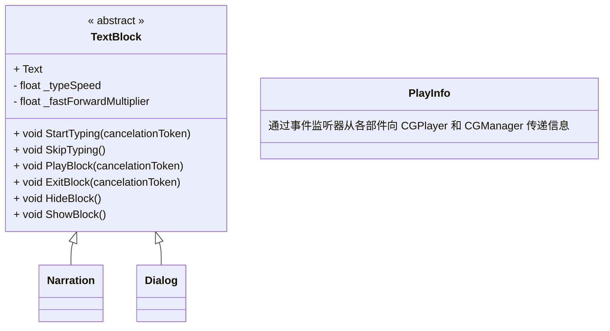
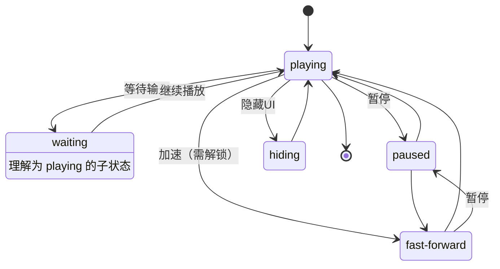

# 类图

```mermaid
classDiagram
	TextBlock <|-- Narration
	TextBlock <|-- Dialog
	
	class TextBlock {
		<< abstract >>
		+ Text
		- float _typeSpeed
		- float _fastForwardMultiplier
		+ void StartTyping(cancelationToken)
		+ void SkipTyping()
		+ void PlayBlock(cancelationToken)
		+ void ExitBlock(cancelationToken)
		+ void HideBlock()
		+ void ShowBlock()
	}

	class Narration {

	}

	class Dialog {

	}

	class PlayInfo {
		通过事件监听器从各部件向 CGPlayer 和 CGManager 传递信息
	}
```

# 状态图

在实现的时候需要保存上一个状态，便于暂停恢复等功能实现。
在原本的设计中还有 waiting 状态，发现与 playing 状态等价，于是合并。
没有标注的箭头均为“恢复原本状态”。

状态由 CG Manager 管理，CG Player 只提供被调用的方法。

```mermaid
stateDiagram-v2
	state "playing" as s1
	state "waiting" as s2 : 理解为 playing 的子状态
	state "paused" as s3
	state "fast-forward" as s4
	state "hiding" as s5
	[*] --> s1
	s1 --> s2 : 等待输入
	s2 --> s1 : 继续播放
	s1 --> s3 : 暂停
	s3 --> s1
	s1 --> s4 : 加速（需解锁）
	s4 --> s1
	s1 --> s5 : 隐藏UI
	s5 --> s1
	s4 --> s3 : 暂停
	s3 --> s4
	s1 --> [*]
```

