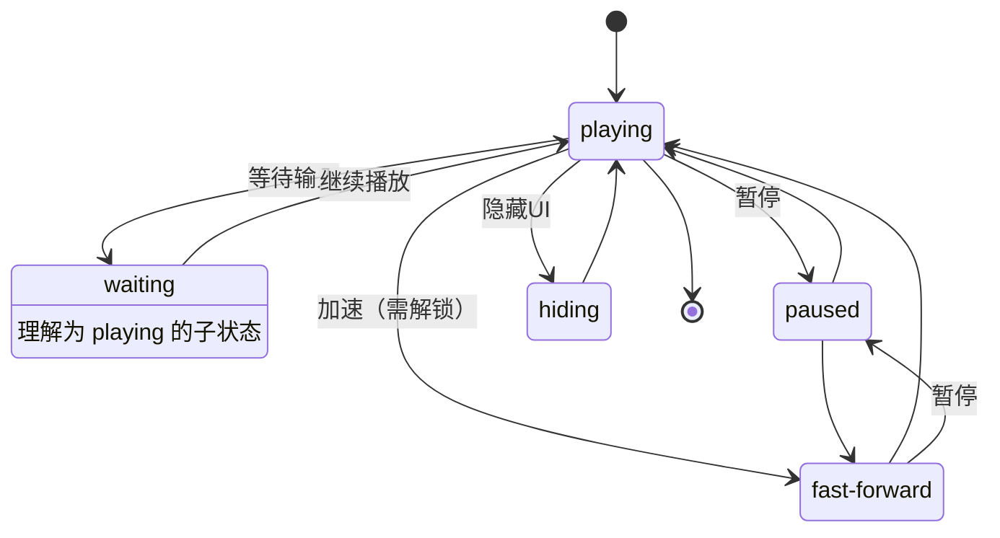

# 概述

将文本和播放指令结合在一起，相当于给程序提供一个剧本，`CGManager`按照剧本中的内容播放

用 xml 文件来储存信息

表头：

- 类型：
	- 场景
	- 各种对话框
	- null (旁白)
- 角色：*类型为对话框时填写*
- 表情：*类型为对话框时填写*
- 中文
- English
- 播放间隔：间隔多久播放下一条指令
	- null: 等待玩家点击
	- 0: 立即播放下一条指令
	- \>0: 毫秒为单位
- 特殊效果：
	- 对话框：表情图抖动等效果
	- 旁白：执行下一条指令前清除所有旁白框（有一处旁白需要这个功能）

对于非程序成员，只需要用 excel 表格填写数据即可，基本都是必要的信息
![[xml示例.png]]

程序需要补充其他规则，维护一个读入剧本的状态机
如下一条指令是对话框时，需要清除正在显示的旁白框

# 系统原理

## 类的功能划分

- CGPlayer: 进行播放操作的主体，控制各个组件
- CGManager: 读入剧本和用户输入，给 CGPlayer 赋值
- Scene, Narration, Dialog: 都是被播放的组件，实现同一组接口

## 信息流动

- CGPlayer 中设置监听器来保存要播放的方法
- CGManager 为 CGPlayer 赋值、触发
- CGPlayer 维护多个监听器
- CGManager 维护状态机，调用 CGPlayer 的不同方法
- 各组件播放完毕后通知 CGPlayer，CGPlayer 整理信息后通知 CGManager

```
CPManager <-> CGPlayer <-> Scene, TextBlock
```


## CGPlayer 作为命令中转站

- CGPlayer 设置几个委托方法数组，由 CGManager 和剧本阅读器等向数组中添加方法
- CGManager 将调用这些方法，因为方法是可等待的，所以 CGPlayer 不用处理状态机，仅仅是方法的执行者
- CGPlayer 设置一个监听器，当各个组件的方法调用结束时，`invoke`这个 listener，CGPlayer 通过返回类型可以得到组件的信息，从而维护委托方法数组

### 向外部暴露的方法

```c#
UniTask async Play()
UniTask async Pause()
UniTask async Stop()
UniTask async Skip()
UniTask async Hide()
UniTask async Show()
UniTask async SetFastForward(bool)
```

CGManager 在调用这些方法时，无需考虑异步操作，**异步处理在 CGPlayer 中完成**

### 维护的委托方法数组

```c#
// 委托方法：播放场景和文本块
public delegate UniTask PlayMethod(bool, CancellationToken);

// 委托方法：跳过/隐藏/显示文本块
// TextBlock 需要另一个数组来维护
public delegate void SkipMethod();
```

## CGManager 状态机

↓ ***outdated***



