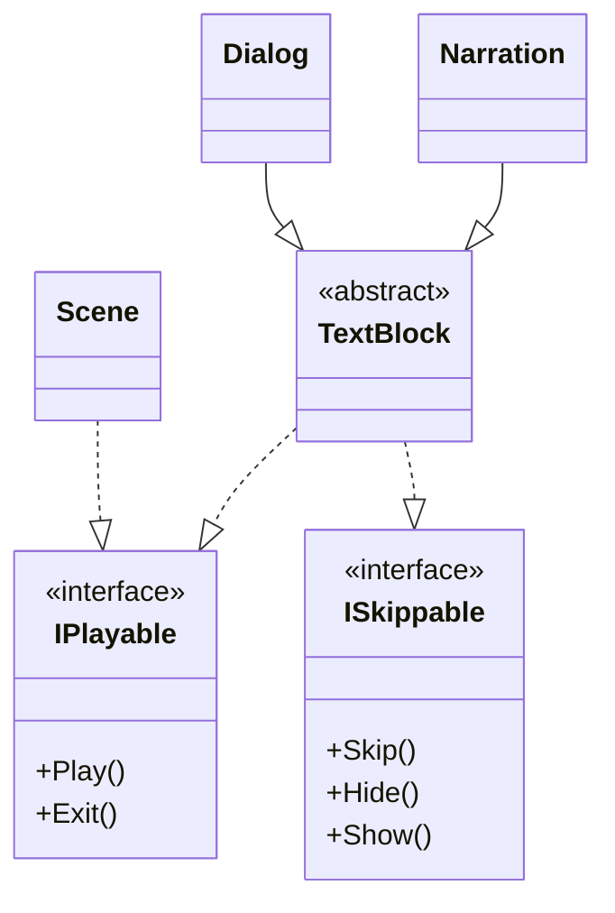
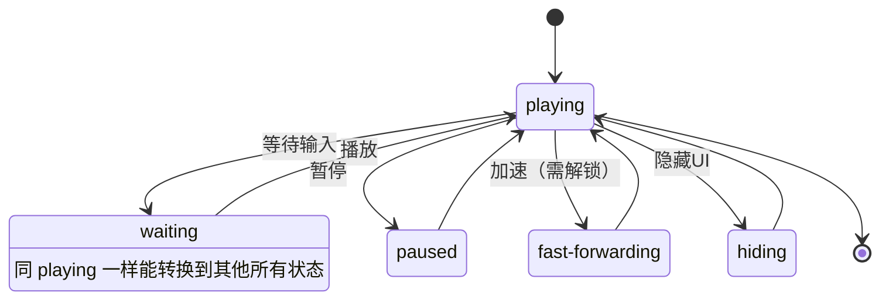

# 概述

将文本和播放指令结合在一起，相当于给程序提供一个剧本，`CGManager`按照剧本中的内容播放

用 xml 文件来储存信息

表头：

- 类型：
	- 场景
	- 各种对话框
	- null (旁白)
- 角色：*类型为对话框时填写*
- 表情：*类型为对话框时填写*
- 中文
- English
- 播放间隔：间隔多久播放下一条指令
	- null: 等待玩家点击
	- 0: 立即播放下一条指令
	- \>0: 毫秒为单位
- 特殊效果：
	- 对话框：表情图抖动等效果
	- 旁白：执行下一条指令前清除所有旁白框（有一处旁白需要这个功能）

对于非程序成员，只需要用 excel 表格填写数据即可，基本都是必要的信息

![[xml示例.png]]

程序需要补充其他规则，维护一个读入剧本的状态机
如下一条指令是对话框时，需要清除正在显示的旁白框

# 系统原理

## 类的功能划分

- CGPlayer: 进行播放操作的主体，控制各个组件
- CGManager: 读入剧本和用户输入，给 CGPlayer 赋值
- Scene, Narration, Dialog: 都是被播放的组件，实现同一组接口

## CGPlayer 作为命令执行者，CGManager 作为中枢

- CGPlayer 设置几个委托方法数组，由 CGManager 维护这个数组
- CGManager 接收剧本和玩家输入，调用 CGPlayer 的方法

## CGManager 状态机

